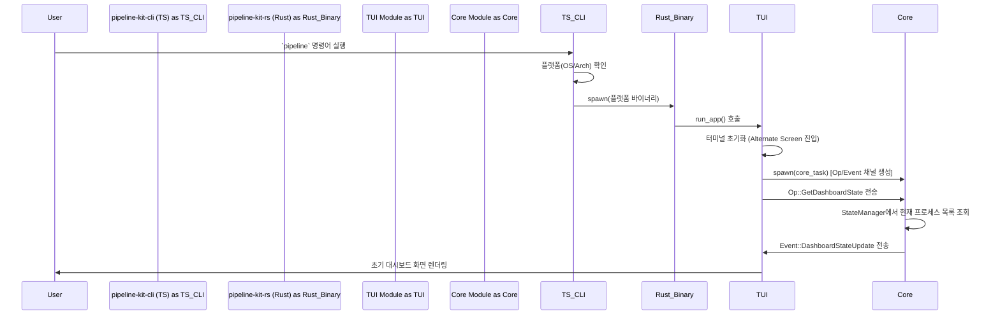
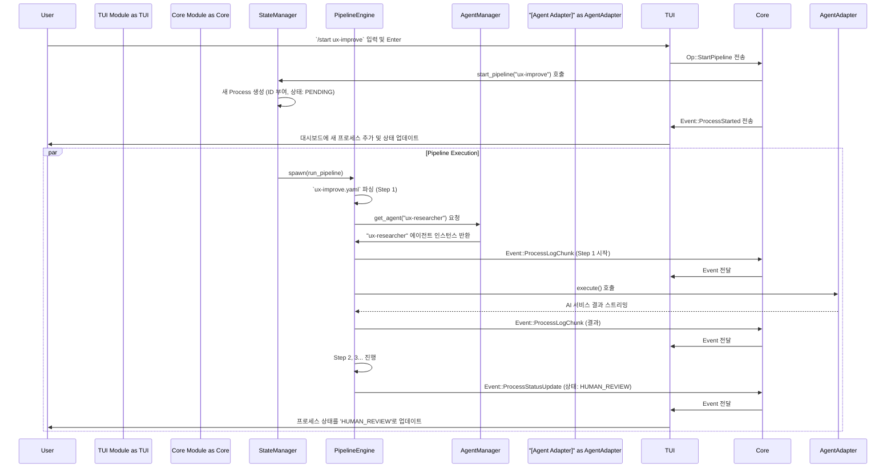
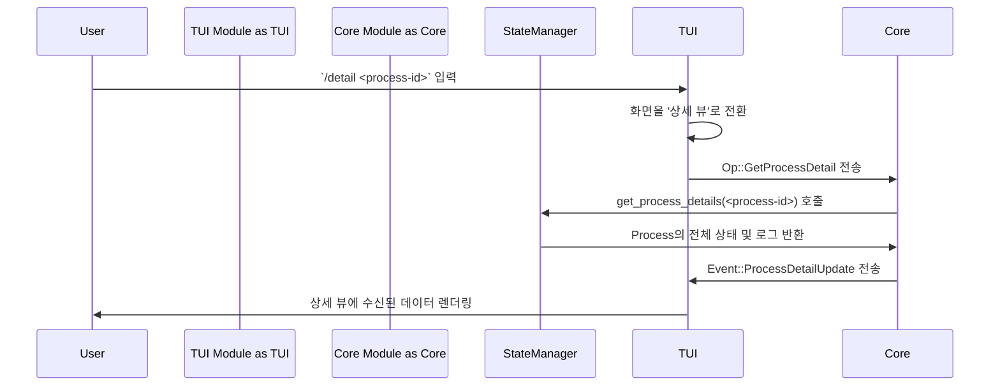

## **pipeline-kit 사용자 흐름(Userflow) 문서**

### **개요**

이 문서는 `pipeline-kit` CLI의 주요 기능들이 내부적으로 어떻게 동작하는지 설명합니다. 각 다이어그램은 사용자의 입력으로부터 시작하여 TypeScript 래퍼(`pipeline-kit-cli`), Rust 코어(`pipeline-kit-rs`), 그리고 그 하위 모듈들(`TUI`, `Core`) 간의 메시지 흐름을 보여줍니다.

**주요 컴포넌트:**

- **User**: 터미널 사용자.
- **pipeline-kit-cli (TS)**: `npm`으로 설치되는 TypeScript 래퍼. Rust 바이너리를 실행하는 역할.
- **pipeline-kit-rs (Rust)**: 핵심 로직이 담긴 네이티브 바이너리.
- **TUI Module**: 터미널 UI를 렌더링하고 사용자 입력을 처리.
- **Core Module**: 모든 비즈니스 로직을 관장하는 백엔드.
- **StateManager**: 실행 중인 모든 파이프라인 프로세스의 상태를 중앙에서 관리.
- **PipelineEngine**: 단일 파이프라인의 실행 흐름을 제어.
- **AgentManager**: `agents/*.md` 설정에 따라 에이전트 인스턴스를 생성하고 제공.
- **[Agent Adapter]**: 특정 AI 서비스(Claude, OpenAI 등)와의 통신을 담당하는 구현체.

---

### **1. 애플리케이션 시작 및 TUI 초기화**

> 사용자가 `pipeline` 명령어를 입력하여 TUI를 시작하는 흐름입니다.



**설명:**

1.  사용자가 터미널에서 `pipeline` 명령어를 실행합니다.
2.  `pipeline-kit-cli` (TypeScript 래퍼)가 실행되어 사용자의 OS와 아키텍처에 맞는 Rust 바이너리를 찾아 `spawn`합니다.
3.  `pipeline-kit-rs` 바이너리가 실행되고, 인수가 없으므로 `TUI` 모듈을 시작합니다.
4.  `TUI`는 터미널을 초기화하고, 별도의 비동기 태스크(Task)에서 `Core` 모듈을 실행합니다. 이 둘은 `Op`(명령)와 `Event`(상태 업데이트)를 주고받는 채널로 연결됩니다.
5.  `TUI`는 초기 화면을 그리기 위해 `Core`에 `Op::GetDashboardState`를 보냅니다.
6.  `Core`는 `StateManager`를 통해 현재 실행 중인 프로세스가 있는지 확인하고, 그 상태를 `Event::DashboardStateUpdate`로 `TUI`에 전달합니다.
7.  `TUI`는 수신한 상태를 기반으로 사용자에게 초기 대시보드 화면을 보여줍니다.

---

### **2. 파이프라인 시작 (`/start <name>`)**

> TUI 내부에서 사용자가 슬래시 커맨드로 특정 파이프라인의 실행을 시작하는 흐름입니다.



**설명:**

1.  사용자가 TUI 입력창에 `/start ux-improve`를 입력합니다.
2.  `TUI` 모듈은 이 입력을 `Op::StartPipeline` 메시지로 변환하여 `Core` 모듈로 전송합니다.
3.  `Core`는 `StateManager`에게 파이프라인 시작을 요청합니다. `StateManager`는 새로운 `Process` 객체를 생성하고 고유 ID를 할당합니다.
4.  `Core`는 즉시 `Event::ProcessStarted` 이벤트를 `TUI`로 보내고, `TUI`는 대시보드를 업데이트하여 사용자에게 새로운 파이프라인이 시작되었음을 알립니다.
5.  `StateManager`는 `PipelineEngine`을 위한 별도의 비동기 태스크를 생성하여 파이프라인 실행을 시작합니다.
6.  `PipelineEngine`은 `ux-improve.yaml`에 정의된 첫 번째 단계를 실행하기 위해 `AgentManager`에게 `ux-researcher` 에이전트를 요청합니다.
7.  `AgentManager`는 설정에 맞는 에이전트 어댑터(`[Agent Adapter]`)를 반환합니다.
8.  `PipelineEngine`이 에이전트를 실행하면, 에이전트는 외부 AI 서비스와 통신합니다.
9.  실행 과정에서 발생하는 모든 로그와 상태 변화는 `Event` 메시지로 `TUI`에 실시간 전달됩니다.
10. `PipelineEngine`이 `HUMAN_REVIEW` 단계를 만나면, `Process`의 상태를 업데이트하고 해당 태스크는 사용자 입력을 기다리며 일시 중단됩니다.

---

### **3. 프로세스 일시 중지 및 재개 (`/pause`, `/resume`)**

> 사용자가 실행 중이거나 `HUMAN_REVIEW` 상태인 프로세스를 제어하는 흐름입니다.

```mermaid
sequenceDiagram
    participant User
    participant TUI Module as TUI
    participant Core Module as Core
    participant StateManager

    User->>TUI: `/pause <process-id>` 입력
    TUI->>Core: Op::PauseProcess 전송
    Core->>StateManager: pause_process(<process-id>) 호출
    StateManager->>StateManager: Process 상태를 'PAUSED'로 변경
    StateManager->>Core: 일시 중지 성공 알림
    Core->>TUI: Event::ProcessStatusUpdate (상태: PAUSED)
    TUI->>User: 대시보드에서 프로세스 상태 업데이트

    ... 잠시 후 ...

    User->>TUI: `/resume <process-id>` 입력
    TUI->>Core: Op::ResumeProcess 전송
    Core->>StateManager: resume_process(<process-id>) 호출
    StateManager->>StateManager: Process 상태를 'RUNNING'으로 변경
    StateManager->>Core: 재개 성공 알림
    Core->>TUI: Event::ProcessStatusUpdate (상태: RUNNING)
    TUI->>User: 대시보드에서 프로세스 상태 업데이트
```

**설명:**

1.  **일시 중지**:
    - 사용자가 `/pause` 명령어를 입력하면 `TUI`는 `Op::PauseProcess`를 `Core`로 보냅니다.
    - `StateManager`는 해당 ID의 `Process`를 찾아 상태를 `PAUSED`로 변경하고, 실행 중인 `PipelineEngine` 태스크에 일시 중지 신호를 보냅니다.
    - 상태 변경이 완료되면 `Event::ProcessStatusUpdate`가 `TUI`로 전송되어 UI가 업데이트됩니다.
2.  **재개**:
    - 사용자가 `/resume` 명령어를 입력하면 `TUI`는 `Op::ResumeProcess`를 `Core`로 보냅니다.
    - `StateManager`는 `Process`의 상태를 다시 `RUNNING`으로 변경하고, `PipelineEngine` 태스크에 재개 신호를 보냅니다.
    - 마찬가지로, 상태 변경이 `Event`를 통해 `TUI`에 반영됩니다. `HUMAN_REVIEW` 상태에서 재개하는 경우도 동일한 흐름을 따릅니다.

---

### **4. 프로세스 상세 정보 조회 (`/detail <id>`)**

> 사용자가 특정 프로세스의 전체 로그와 상세 정보를 확인하는 흐름입니다.



**설명:**

1.  사용자가 `/detail` 명령어를 입력하면 `TUI`는 화면 모드를 상세 정보 뷰로 전환합니다.
2.  동시에 `Op::GetProcessDetail` 메시지를 `Core`로 보내 해당 프로세스의 전체 데이터를 요청합니다.
3.  `StateManager`는 저장된 `Process` 객체에서 모든 정보(전체 로그, 현재 상태, 파이프라인 정의 등)를 조회하여 반환합니다.
4.  `Core`는 조회된 데이터를 `Event::ProcessDetailUpdate`에 담아 `TUI`로 보냅니다.
5.  `TUI`는 이 데이터를 사용하여 스크롤 가능한 상세 정보 화면을 사용자에게 렌더링합니다.
